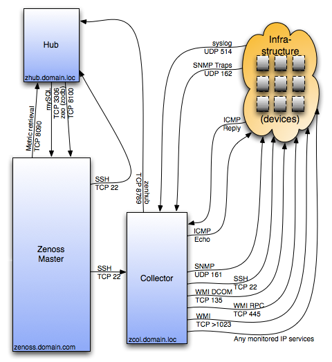

========================================================================
Collectors and Custom Parsers
========================================================================

Collecting data is the fundamental goal of Zenoss. This section explores
specific tasks related to data collection and parsing that data.

Prerequisites
------------------------------------------------------------------------------

* Zenoss ZenPack Developement Guide

We assume that you are familiar with ZenPack developement and Python coding.
We further assume that we work from the base of ZP_DIR.
For NetBotz for example::

  ZP_DIR_TOP=$ZENHOME/ZenPacks/ZenPacks.training.NetBotz
  ZP_DIR=$ZP_DIR_TOP/ZenPacks/training/NetBotz

As you should know, collectors and parsers typically live in the folder::

  $ZP_DIR/datasources
  $ZP_DIR/parsers

Debugging Tips in General
---------------------------------------------------
* Run the collector manually like this::

   zencommand run  -workers=0 -v10 -d mp3.zenoss.loc |& tee collect.log

* If you don't get any output, you can try these basic steps:

  - Restart zenhub: it may have given up loading the modeler
  - Rerun zencommand and also monitor /opt/zenoss/log/zenhub.log for good
    measure. You may want to run zenhub in the foreground.

* To test your parser command at a low level use::

    cd /opt/zenoss/Products/ZenHub/services
    python CommandPerformanceConfig.py -d mp1.zenoss.loc

Generalities
------------------------------------------------------------------------

Collection process has the following steps:

* A collection process (a collector) is started, often with ZenCommand
  against a collector name (db2.zenoss.loc).
* The collector contacts Zenhub and load the commands to be run against
  devices for that collector (target)
* Zencommand runs the collection command on the remote target.
* If and when results are returned, a parser is created.
* Zencommand passes results to the processResults() method of the parser.
* The processResults() method is passed the command configuration fetched
   from ZenHub, and also an object into which parsed results will be placed.
* Zencommand takes the returned Python dictionary from the parser and updates
  the ZODB

.. math:: 

  \begin{array}{ccccc}
   HOST_a    &                       &Collect(targets)&\xrightarrow{a} & (Results) \\
  \downarrow &                       & \uparrow_a     &                & \downarrow \\
  \fbox{ZC/ZP}&^a_b\rightleftharpoons&\fbox{Zenhub}   &\xleftarrow[b]{}& (Parser,  \\
  \downarrow_b&                      &                &                &  Result)  \\
  \fbox{ZODB}&                       &                &                &            \\
  \end{array}

Ref: http://docs.huihoo.com/zenoss/dev-guide/2.4.2/ch12s05.html

Collectors
###########

Collection can happen with a native plugin like [ssh, snmp, ping, https, etc.] or a
custom plugin that you create. The output can come back in several formats like
[Nagios, Cacti, JSON] or a custom format that you specify. Custom formats
must be handled by you using a *custom parser*.

Sometimes we refer to collectors as *pollers* or *collection plugins*. Since the 
collector/plugin information is passed to Zenhub, it must be an exectuable
program or script.

An example of a custom poller that outputs JSON is shown below.
The example is pilfered from ZenPacks.zenoss.DB2:

.. code-block:: python

   #!/usr/bin/env python
   import sys
   from lib import txdb2jdbc

   class db2Poller(object):
    _connectionString = None     # DB2 JDBC ConnectionStrings only
    _query = None                # A Valid DB2 SQL query
    _data = None                 # This is JSON data from Java connector

    def __init__(self, conString, myQuery):
        self._connectionString = conString
        self._query = myQuery

    def getData(self):
        db2 = txdb2jdbc.Database(self._connectionString)
        self._data = db2.query_json(self._query)
        return self._data

    def printJSON(self):
        data = None
        try:
            data = self.getData()

        except Exception, ex:
            print "Exception", ex
        print data

    if __name__ == '__main__':
        usage = "Usage: {0} <connectionString> <query>"
        connectionString = None

        try:
            connectionString = sys.argv[1]
            query = sys.argv[2]

        except IndexError:
            print "poll_db2 : insufficient parameters"
            print >> sys.stderr, usage.format(sys.argv[0])
            sys.exit(1)

        except ValueError:
            print >> sys.stderr, usage.format(sys.argv[0])
            sys.exit(1)

        poller = db2Poller(connectionString, query)
        poller.printJSON()

Note that you must normally setup your plugins in you __init__.py so that they
have proper scope and permissions. See the ZenPacks.zenoss.DB2 setup for example.

Collection
###########

